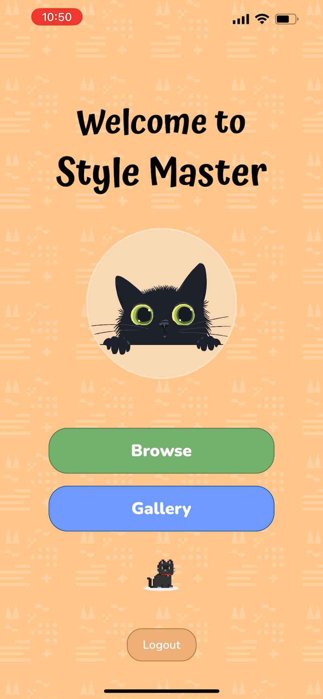
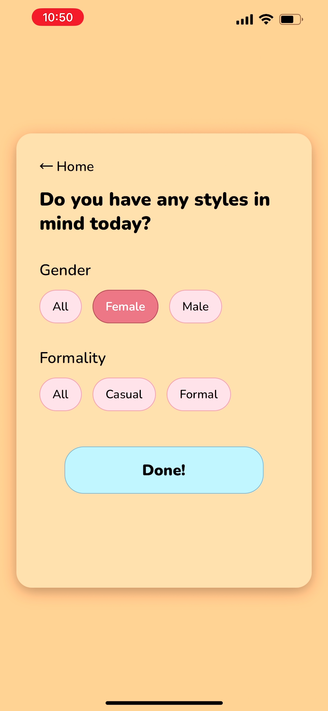
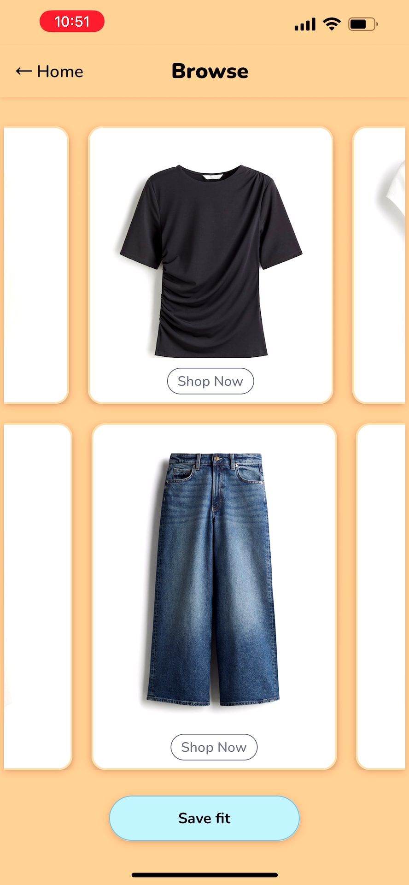
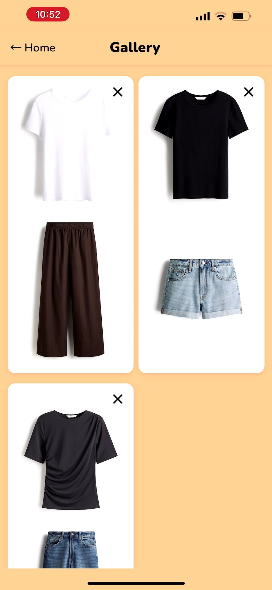

# StyleMaster

Effortless and fashionable outfits, picked in record time. Our mobile app was designed to allow the user to curate different outfits from reliable clothing store outlets easily! Runs on both iOS and Android.

## Demo

Watch demo video [here](https://youtu.be/atBWUuJZ4-E)
[](https://youtu.be/atBWUuJZ4-E)

## Screenshots







<!-- 


 -->

## How to set up:

1. [Setup Expo environment according to Docs](https://docs.expo.dev/get-started/set-up-your-environment/)
2. Run the following commands:

```bash
cd frontend
npm install
npx expo start
cd ../backend
pip install -r requirements.txt
playwright install
```

## How to run:

1. Start the backend server by running `python app.py` in the `/backend` terminal.
2. Start the frontend Expo app:
   - Run `npx expo start` in the /frontend terminal and scan the QR code using the Expo Go app or enter in the URL
